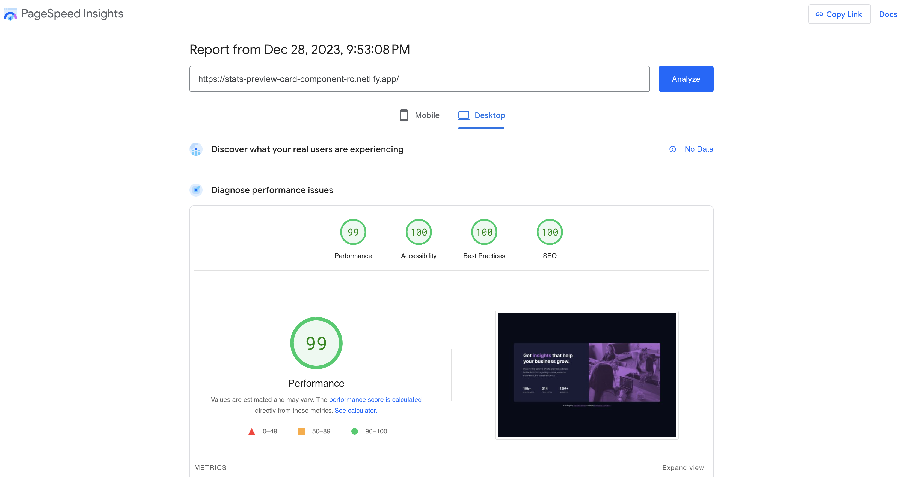

# Frontend Mentor - Stats preview card component solution

This is a solution to the [Stats preview card component challenge on Frontend Mentor](https://www.frontendmentor.io/challenges/stats-preview-card-component-8JqbgoU62). Frontend Mentor challenges help you improve your coding skills by building realistic projects. 

## Table of contents

- [Overview](#overview)
  - [The challenge](#the-challenge)
  - [Screenshots](#screenshots)
  - [PageSpeed Insights results](#pagespeed-insights-results)
  - [Links](#links)
- [My process](#my-process)
  - [Built with](#built-with)
  - [Tested with](#tested-with)
  - [What I learned](#what-i-learned)
  - [Continued development](#continued-development)
  - [Useful resources](#useful-resources)
- [Author](#author)
- [Acknowledgments](#acknowledgments)

## Overview

### The challenge

Users should be able to:

- View the optimal layout depending on their device's screen size

### Screenshots

### PageSpeed Insights results
[Mobile version](https://pagespeed.web.dev/analysis/https-stats-preview-card-component-rc-netlify-app/jnuyjpawsu?form_factor=mobile)

[Desktop version](https://pagespeed.web.dev/analysis/https-stats-preview-card-component-rc-netlify-app/jnuyjpawsu?form_factor=desktop)

### Links

- Solution URL: [Stats preview card component card github](https://github.com/rupali317/stats-preview-card-component)
- Live Site URL: [Stats preview card component card challenge live](https://stats-preview-card-component-rc.netlify.app/)

## My process

### Built with

- Semantic HTML5 markup
- CSS custom properties
- Flexbox
- Mobile-first workflow
- [React](https://reactjs.org/) - JS library
- [Styled Components](https://styled-components.com/) - For styles

### Tested with

- [jest-dom Testing Library](https://github.com/testing-library/jest-dom?tab=readme-ov-file) - provides a set of custom jest matchers that one can use to extend jest. These will make tests more declarative, clear to read and to maintain. As part of that goal, one wants to avoid all the repetitive patterns that arise in doing so. Checking for an element's attributes, its text content, its css classes, etc.
- Browsers used for testing: Google Chrome, Firefox, Safari, Brave, Microsoft Edge
- Devices: 
  - (Real) MacBook Pro (15 inch), Samsung Galaxy A33 5G, Samsung Galaxy S20+
  - (Virtual) The mobile and tablet devices mentioned under Chrome's dev console

### What I learned

- The difference between `background-blend-mode` and `mix-blend-mode`. The former is used in conjunction with background-image declaration. It blends between the layers of a background-image declaration. The latter blends HTML elements and is more inclusive.

### Continued development

- I used CSP in HTML http-equiv meta tags. In future projects, I wish to move the CSP to HTTP header. 
- For CSP, I have used 'unsafe-inline' even though I have not used inline styles in my project. Perhaps React is generating inline styles during runtime. I added the unsafe-inline otherwise the styles would not be applied. unsafe-inline was a quick fix but this is not a good practice since it is not safe against XSS. I would like to explore nonces or hashes to allow inline styles.
- I want to keep practising more test cases for testing UI styles by using jest-dom testing library.

### Useful resources

- [mix-blend-mode vs background-blend-mode](https://alistapart.com/article/blending-modes-demystified/) - This blog differentiates on when these properties are used.
- [Section vs Article](https://www.smashingmagazine.com/2022/07/article-section-elements-accessibility/) - This blog illustrates the use cases on when to use section tag vs article tag. I was impressed by the detailed examples.
- [Picture element](https://fedmentor.dev/posts/html-plan-product-preview/#product-image) - This blog introduced me to the usage of picture element and its benefits about having good performance and letting us write cleaner and maintainable code.

## Author

- Website - [Rupali Roy Choudhury](https://www.linkedin.com/in/rupali-rc/)
- Frontend Mentor - [@rupali317](https://www.frontendmentor.io/profile/rupali317)

## Acknowledgments

I express my gratitude towards my mentor - Deborah for the insightful code review session
